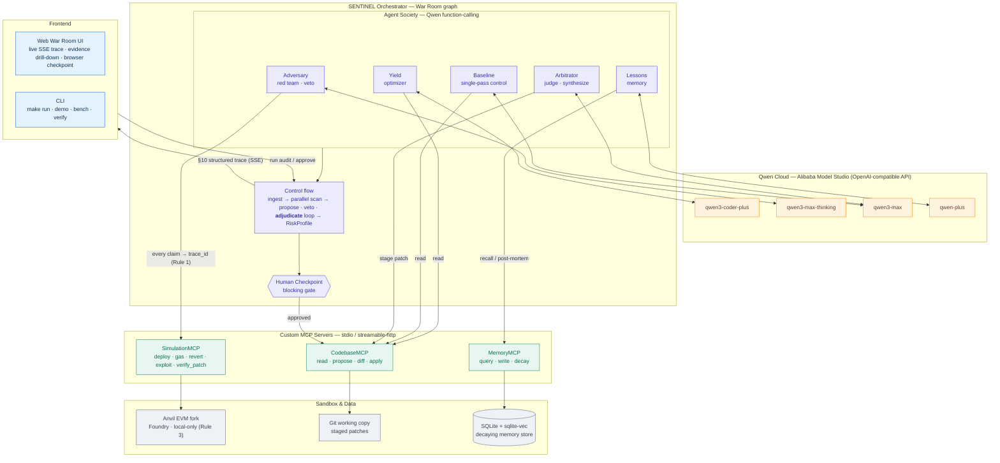

# SENTINEL

A multi-agent "war room" that argues about whether your protocol is safe to
ship — using real simulation data, real institutional memory, and a real human
in the loop for the decisions that matter.

Submitted to the Qwen Cloud Global AI Hackathon, Track 3 (Agent Society)
primary, with Track 1 (Memory) and Track 4 (Autopilot) as integrated
sub-tracks.

- **What it is / how it works:** see [`architecture.md`](architecture.md).
- **How we build it (rules, tooling, DoD):** see [`CLAUDE.md`](CLAUDE.md).
- **How to deploy + record the Alibaba Cloud verification:** see
  [`deploy/DEPLOY.md`](deploy/DEPLOY.md).

## Architecture

Five Qwen-backed agents argue inside a War Room orchestrator; every factual
claim is sourced from a real MCP tool call (Golden Rule 1), and any apply
decision blocks on a human checkpoint (Golden Rule 2). Source:
[`docs/architecture.mmd`](docs/architecture.mmd) ·
PNG: [`docs/architecture.png`](docs/architecture.png).



## Quick start

```bash
make run-demo   # reproducible showcase — no API keys needed
make run        # the real thing — live Qwen agents (needs QWEN_* in .env)
```

Both are one command: they install dependencies and run the two-session War Room
against a live Anvil sandbox (real simulation data, real institutional memory, a
real blocking human checkpoint), then print the
[`architecture.md`](architecture.md) §11 efficiency table. **The sandbox is
started and stopped automatically** — no manual setup or teardown.

- **`make run-demo`** uses deterministic demo drivers that make *real*
  `SimulationMCP` calls (Golden Rule 1 preserved) — fully reproducible, no
  credentials. This is the showcase / what CI validates.
- **`make run`** runs the real five-agent Qwen War Room. Set `QWEN_*` in `.env`
  first; if they're unset it prints a notice and falls back to the demo drivers,
  so it still works.

The only prerequisite is **Foundry** (one-time: `curl -L
https://foundry.paradigm.xyz | bash && foundryup`); Python 3.11+ is provisioned
by `uv`. Copy `.env.example` to `.env` for `ANVIL_FORK_URL` and the `QWEN_*`
credentials.

The checkpoint auto-approves with a clearly-labelled demo decision; pass
`--interactive` (`uv run python -m demo.run_demo --interactive`, with the sandbox
running) for the real `rich` prompt.

## Web UI (browser War Room)

```bash
make run-web    # one command: set up, then serve the UI (sandbox auto-managed)
```
Then open **http://localhost:8088**.

## Efficiency benchmark (Track 3: measurable gain vs single-agent baseline)

```bash
make bench      # audits a corpus with the single-pass Baseline AND the War Room
```

Scores both against a known ground truth and prints the comparison. On the
current 3-contract corpus the multi-agent Society beats the single-agent baseline
on every axis — e.g. **100% vs 67% detection**, **3 vs 0 trade-offs surfaced**,
**0 vs 1 false negatives**, **22 vs 0 trace-backed (real-simulation) claims**. The
gap is structural: a single-pass source reader cannot see a simulation-discovered
DoS or quantify residual risk. Scoring lives in
`src/sentinel/orchestrator/benchmark.py`; adding contracts grows the corpus.

## Patch verification (prove a fix, don't just suggest one)

```bash
make verify     # re-runs the exact exploit against the vulnerable + patched contract
```

Deploys both contracts and runs the same reentrancy attack on each: it drains
**0.3 ETH** from `SubscriptionBilling` and is **blocked (reverts)** on the
reentrancy-guarded patch — a real before/after read off a live Anvil run, not a
claim. Exposed as the `verify_patch` MCP tool
(`src/sentinel/mcp_servers/simulation_mcp/`).

A single-page view of the same audit: the War Room timeline streams live (SSE),
every cited number is one click from the real `SimulationMCP` result behind it
(Golden Rule #1, made visible), and the Human Checkpoint is driven by a button
that genuinely blocks the run (Golden Rule #2). It's a *read-only renderer* of
the §10 trace stream — it never originates an agent claim. Design and internals:
[`architecture.md`](architecture.md) §18.

## Run the full stack in Docker

```bash
make docker-up      # anvil + 3 MCP servers + orchestrator (architecture.md §15)
```

The same `docker-compose.yml` is the Alibaba Cloud deployment artifact —
`ECS_HOST=user@ip make deploy` ships it to an ECS instance. See
[`deploy/DEPLOY.md`](deploy/DEPLOY.md) for provisioning and the verification clip.

## Status

The War Room (Yield / Adversary / Arbitrator / Lessons / Baseline agents), all
three custom MCP servers, the decaying memory store, the blocking human
checkpoint, the orchestration graph, and the end-to-end demo are implemented and
covered by unit + integration (real-Anvil) + golden-trace tests. The default demo
agents are deterministic drivers making **real** `SimulationMCP` calls (Golden
Rule 1 preserved). The live Qwen agents are **wired** behind the same interfaces
(`make dev` / `run_demo --live`, demo-driver fallback when creds are absent) and
verified offline by a mocked-client smoke test — only live Qwen credentials
remain before they run for real.

## License

[MIT](LICENSE). `CodebaseMCP` and `SimulationMCP` are intended to be useful
standalone to any team auditing Solidity/EVM code (architecture.md §16).
